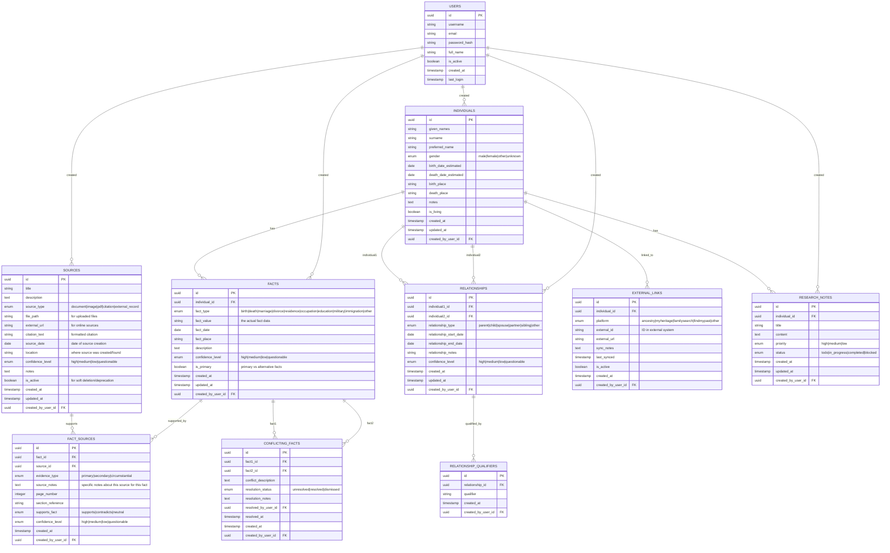

# Genealogical Sources Management App

A full-stack web application for managing genealogical sources, built with Flask (Python) backend and React frontend, containerized with Docker.

## Project Status

🚧 **Early Development Stage**  
The application is in its initial phase with basic scaffolding completed. Backend and frontend are connected, Docker builds and serves successfully. APIs and models are in progress.

## Features

### Current Features
- **Source Management**: Create, read, update, and delete genealogical sources
- **Source Types**: Support for different source types (documents, photos, records)
- **Tag System**: Basic tagging infrastructure (backend ready)
- **RESTful APIs**: Flask backend providing JSON APIs

### Planned Features

- Advanced search and filtering capabilities
- Source categorization and tagging system
- User authentication and authorization
- OCR integration for scanned sources
- Source citation formats (e.g., Evidence Explained)
- GEDCOM import/export

## Tech Stack

- **Backend**: Python 3.11+, Flask, SQLAlchemy, Alembic
- **Frontend**: React 18+, Vite, TypeScript (future)
- **Database**: PostgreSQL (or SQLite for development)
- **Containerization**: Docker, Docker Compose
- **Version Control**: Git

## Project Structure

```
GenSource/
├── README.md
├── LICENSE
├── docker-compose.yml
├── .dockerignore
├── .gitignore
├── .env.example                    # Environment template
├── docs/                           # Documentation
│   ├── er_model_diagram.md         # Database design
│   ├── project_structure.md        # This file
│   ├── api_documentation.md        # API specs
│   ├── deployment_guide.md         # Deployment instructions
│   └── user_workflows.md           # User experience flows
├── scripts/                        # Development and deployment scripts
│   ├── setup_dev.sh                # Development environment setup
│   ├── backup_db.sh                # Database backup
│   ├── restore_db.sh               # Database restore
│   └── seed_data.py                # Sample data for development
├── docker/                         # Docker configuration
│   ├── Dockerfile.backend
│   ├── Dockerfile.frontend
│   └── nginx.conf                  # Production nginx config
├── backend/                        # Flask API server
│   ├── requirements.txt
│   ├── requirements-dev.txt        # Development dependencies
│   ├── run.py                      # Application entry point
│   ├── migrate.py                  # Database migration script
│   ├── app/                        # Main application package
│   │   ├── __init__.py             # App factory
│   │   ├── config.py               # Configuration settings
│   │   ├── models/                 # Database models (organized by domain)
│   │   │   ├── __init__.py
│   │   │   ├── base.py             # Base model with common fields
│   │   │   ├── user.py             # User model
│   │   │   ├── source.py           # Source-related models
│   │   │   ├── individual.py       # Individual and fact models
│   │   │   ├── relationship.py     # Relationship models
│   │   │   └── research.py         # Research notes and conflicts
│   │   ├── api/                    # API routes organized by domain
│   │   │   ├── __init__.py
│   │   │   ├── sources.py          # Source management endpoints
│   │   │   ├── individuals.py      # Individual management endpoints
│   │   │   ├── facts.py            # Fact management endpoints
│   │   │   ├── relationships.py    # Relationship endpoints
│   │   │   ├── research.py         # Research workflow endpoints
│   │   │   ├── external.py         # External system integration
│   │   │   └── reports.py          # Reporting and analysis endpoints
│   │   ├── services/               # Business logic layer
│   │   │   ├── __init__.py
│   │   │   ├── source_service.py   # Source management logic
│   │   │   ├── fact_service.py     # Fact extraction and validation
│   │   │   ├── conflict_service.py # Conflict detection and resolution
│   │   │   ├── external_sync.py    # External platform synchronization
│   │   │   └── file_service.py     # File upload and management
│   │   ├── utils/                  # Utility functions
│   │   │   ├── __init__.py
│   │   │   ├── validators.py       # Data validation utilities
│   │   │   ├── formatters.py       # Citation and date formatting
│   │   │   ├── file_handlers.py    # File processing (PDF, images)
│   │   │   ├── date_parser.py      # Genealogical date parsing
│   │   │   └── confidence.py       # Confidence level calculations
│   │   └── exceptions/             # Custom exceptions
│   │       ├── __init__.py
│   │       ├── source_exceptions.py
│   │       └── validation_exceptions.py
│   ├── migrations/                 # Database migrations
│   │   ├── alembic.ini
│   │   ├── env.py
│   │   ├── README
│   │   ├── script.py.mako
│   │   └── versions/
│   ├── tests/                      # Backend tests
│   │   ├── __init__.py
│   │   ├── conftest.py             # Test configuration
│   │   ├── test_models/            # Model tests
│   │   ├── test_api/               # API endpoint tests
│   │   ├── test_services/          # Service layer tests
│   │   └── test_utils/             # Utility function tests
│   └── uploads/                    # File upload storage (development)
│       ├── sources/                # Source documents
│       ├── images/                 # Image files
│       └── temp/                   # Temporary processing files
├── frontend/                       # React application
│   ├── package.json
│   ├── package-lock.json
│   ├── vite.config.js
│   ├── eslint.config.js
│   ├── index.html
│   ├── public/                     # Static assets
│   │   ├── vite.svg
│   │   └── favicon.ico
│   └── src/                       # React source code
│       ├── main.jsx               # Application entry point
│       ├── App.jsx                # Main App component
│       ├── App.css                # App-specific styles
│       ├── index.css              # Global styles
│       ├── assets/                # Static assets
│       ├── components/            # Reusable UI components
│       │   ├── common/            # Generic components
│       │   │   ├── Button.jsx
│       │   │   ├── Modal.jsx
│       │   │   ├── FileUpload.jsx
│       │   │   ├── DatePicker.jsx
│       │   │   └── ConfidenceIndicator.jsx
│       │   ├── sources/           # Source-related components
│       │   │   ├── SourceList.jsx
│       │   │   ├── SourceForm.jsx
│       │   │   ├── SourceDetail.jsx
│       │   │   ├── SourceViewer.jsx
│       │   │   └── SourceReliability.jsx
│       │   ├── individuals/       # Individual-related components
│       │   │   ├── IndividualList.jsx
│       │   │   ├── IndividualForm.jsx
│       │   │   ├── IndividualDetail.jsx
│       │   │   └── IndividualTimeline.jsx
│       │   ├── facts/             # Fact management components
│       │   │   ├── FactList.jsx
│       │   │   ├── FactForm.jsx
│       │   │   ├── FactDetail.jsx
│       │   │   └── FactConflicts.jsx
│       │   ├── relationships/     # Relationship components
│       │   │   ├── RelationshipDiagram.jsx
│       │   │   ├── RelationshipForm.jsx
│       │   │   └── FamilyTree.jsx
│       │   ├── research/          # Research workflow components
│       │   │   ├── ResearchNotes.jsx
│       │   │   ├── ConflictResolution.jsx
│       │   │   └── SourceAnalysis.jsx
│       │   └── reports/           # Reporting components
│       │       ├── IndividualReport.jsx
│       │       └── SourceReport.jsx
│       ├── pages/                 # Page-level components
│       │   ├── Dashboard.jsx
│       │   ├── SourceManagement.jsx
│       │   ├── IndividualManagement.jsx
│       │   ├── ResearchWorkspace.jsx
│       │   ├── Reports.jsx
│       │   └── Settings.jsx
│       ├── hooks/                 # Custom React hooks
│       │   ├── useApi.js          # API interaction hook
│       │   ├── useFileUpload.js   # File upload hook
│       │   ├── useDebounce.js     # Debouncing hook
│       │   └── useLocalStorage.js # Local storage hook
│       ├── services/              # Frontend services
│       │   ├── api.js             # API client configuration
│       │   ├── sourceService.js   # Source API calls
│       │   ├── individualService.js # Individual API calls
│       │   ├── factService.js     # Fact API calls
│       │   ├── relationshipService.js # Relationship API calls
│       │   └── fileService.js     # File handling service
│       ├── utils/                 # Frontend utilities
│       │   ├── dateUtils.js       # Date formatting and parsing
│       │   ├── validators.js      # Form validation
│       │   ├── formatters.js      # Data formatting
│       │   ├── constants.js       # Application constants
│       │   └── helpers.js         # General helper functions
│       ├── styles/                # Styling
│       │   ├── globals.css        # Global styles
│       │   ├── variables.css      # CSS variables
│       │   └── components/        # Component-specific styles
│       └── __tests__/             # Frontend tests
│           ├── components/        # Component tests
│           ├── pages/             # Page tests
│           ├── hooks/             # Hook tests
│           └── utils/             # Utility tests
└── storage/                       # Production file storage
    ├── sources/                   # Source documents
    ├── images/                    # Image files
    ├── backups/                   # Database backups
    └── exports/                   # Generated reports and exports
```

## Setup

### Prerequisites

- **Docker**: For containerized development and deployment
- **Node.js**: For frontend development (v18+ recommended)
- **Python**: For backend development (v3.11+ recommended)
- **pip**: Python package manager
- **npm** or **yarn**: JavaScript package manager

### Quick Start with Docker

1. **Clone the repository**:
   ```bash
   git clone https://github.com/<user>/gen-source.git
   cd gen-source
   ```
2. **Start all services**:
   ```bash
   docker-compose up --build
   ```
3. **Set up environment variables**:
   - see next section for details
4. **Update the database** (first time only):
   ```bash
   docker exec -it <backend_container> flask db upgrade
   ```
5. **Access the application**:
   - Frontend: http://localhost:3000
   - Backend API: http://localhost:5000
   - Database: localhost:5432

### Environment Variables

Create a `.env` file with the following:

```
# Database
POSTGRES_DB=genealogy_db
POSTGRES_USER=postgres
POSTGRES_PASSWORD=<your_postgres_password>
POSTGRES_HOST=localhost
POSTGRES_PORT=5432

# Flask
FLASK_APP=run.py
FLASK_ENV=development
SECRET_KEY=your-secret-key-here

# Frontend
VITE_API_URL=http://localhost:5000/api
```

### Local Development (without Docker)

#### Backend

1. **Navigate to backend directory**:
   ```bash
   cd backend
   ```

2. **Create virtual environment** (optional):
   ```bash
   python -m venv venv
   source venv/bin/activate  # On Windows: venv\Scripts\activate or PowerShell: .\venv\Scripts\Activate.ps1
   ```

3. **Install dependencies**:
   ```bash
   pip install -r requirements.txt
   ```

4. **Start the development server**:
   ```bash
   flask run
   ```

#### Frontend

1. **Navigate to frontend directory**:
   ```bash
   cd frontend
   ```

2. **Install dependencies**:
   ```bash
   npm install
   ```

3. **Start the development server**:
   ```bash
   npm run dev
   ```

#### Database Setup

1. **Install PostgreSQL** on your system
2. **Create database**:
   ```
   psql -U postgres -c "CREATE DATABASE genealogy_db;"
   ```

3. **Run migrations**:
   ```bash
   cd backend
   flask db upgrade
   ```

## Database Schema

The app uses the following database tables:

- **sources**: Main table for genealogical sources (title, description, type, date, location)
- **users**: User authentication (future feature)
- **tags**: For categorizing sources
- **source_tags**: Many-to-many relationship between sources and tags

### Entity Relationship Diagram



## API Endpoints

- `GET /api/sources` - List all sources
- `POST /api/sources` - Create new source
- `GET /api/sources/{id}` - Get source details
- `PUT /api/sources/{id}` - Update source
- `DELETE /api/sources/{id}` - Delete source
- `GET /api/tags` - List all tags
- `POST /api/tags` - Create new tag
- `GET /health` - Check application 

## Development Workflow

### With Docker (Recommended)

1. **Start development environment**:
   ```bash
   docker-compose up
   ```

2. **Make changes** to your code (hot reload enabled)

3. **Run database migrations** when models change:
   ```bash
   docker-compose exec backend python migrate.py
   ```

4. **View logs**:
   ```bash
   docker-compose logs -f backend  # Backend logs
   docker-compose logs -f frontend # Frontend logs
   ```

5. **Stop services**:
   ```bash
   docker-compose down
   ```

### Manual Development

#### Backend
1. **Activate virtual environment**:
   ```bash
   cd backend
   source venv/bin/activate
   ```

2. **Install new dependencies**:
   ```bash
   pip install package-name
   pip freeze > requirements.txt
   ```

3. **Create database migration**:
   ```bash
   flask db migrate -m "Description of changes"
   flask db upgrade
   ```

#### Frontend
1. **Install new packages**:
   ```bash
   cd frontend
   npm install package-name
   ```

2. **Run linting**:
   ```bash
   npm run lint
   ```

3. **Build for production**:
   ```bash
   npm run build
   ```

### Database Migrations

To apply database migrations:
```bash
# With Docker
docker-compose exec backend flask db migrate -m "Add new field"
docker-compose exec backend flask db upgrade

# Local development
cd backend
flask db migrate -m "Add new field"
flask db upgrade
```
## Troubleshooting

### Common Issues

**Port already in use**:
```bash
# Check what's using the port
netstat -tulpn | grep :3000
# Kill the process or change ports in docker-compose.yml
```

**Database connection failed**:
- Ensure PostgreSQL is running
- Check DATABASE_URL environment variable
- Verify database credentials
- For Docker: ensure `db` service is healthy

**Frontend not loading**:
- Check if backend is running on port 5000
- Verify CORS configuration in Flask
- Check browser console for errors

**Docker build fails**:
```bash
# Clean Docker cache
docker system prune -a
# Rebuild without cache
docker-compose build --no-cache
```

**Permission denied (Linux/Mac)**:
```bash
# Fix file permissions
sudo chown -R $USER:$USER .
```

**Database migration errors**:
```bash
# Reset migrations (development only)
rm -rf backend/migrations/versions/*
docker-compose exec backend flask db stamp head
docker-compose exec backend flask db migrate -m "Initial migration"
docker-compose exec backend flask db upgrade
```

## Contributing

1. **Fork the repository**
2. **Create a feature branch**: `git checkout -b feature/amazing-feature`
3. **Make your changes** and test thoroughly
4. **Commit your changes**: `git commit -m 'Add amazing feature'`
5. **Push to the branch**: `git push origin feature/amazing-feature`
6. **Open a Pull Request**

### Development Guidelines
- Follow PEP 8 for Python code
- Use ESLint configuration for JavaScript/React
- Write descriptive commit messages
- Add tests for new features
- Update documentation as needed

## License

This project is licensed under the MIT No-Resale License - see the [LICENSE](LICENSE) file for details.

**Summary**: You can use this software in your work, including commercial projects, but you cannot sell the software itself as a standalone product.
