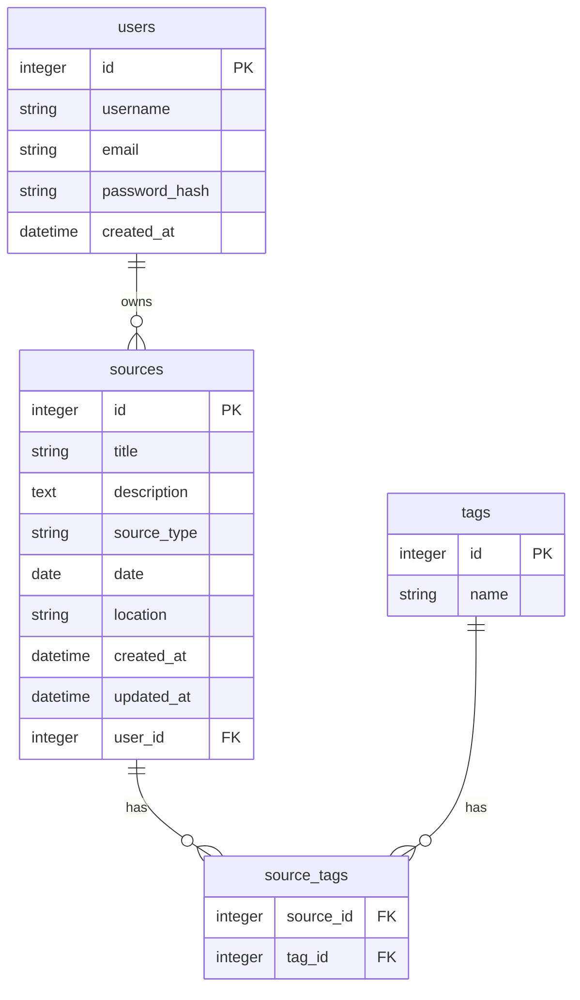

# Genealogical Sources Management App

A full-stack web application for managing genealogical sources, built with Flask (Python) backend and React frontend, containerized with Docker.

## Project Status

🚧 **Early Development Stage**  
The application is in its initial phase with basic scaffolding completed. Backend and frontend are connected, Docker builds and serves successfully. APIs and models are in progress.

## Features

### Current Features
- **Source Management**: Create, read, update, and delete genealogical sources
- **Source Types**: Support for different source types (documents, photos, records)
- **Tag System**: Basic tagging infrastructure (backend ready)
- **RESTful APIs**: Flask backend providing JSON APIs

### Planned Features

- Advanced search and filtering capabilities
- Source categorization and tagging system
- User authentication and authorization
- OCR integration for scanned sources
- Source citation formats (e.g., Evidence Explained)
- GEDCOM import/export

## Tech Stack

- **Backend**: Python 3.11+, Flask, SQLAlchemy, Alembic
- **Frontend**: React 18+, Vite, TypeScript (future)
- **Database**: PostgreSQL (or SQLite for development)
- **Containerization**: Docker, Docker Compose
- **Version Control**: Git

## Project Structure

```
GenSource/
├── README.md
├── LICENSE
├── docker-compose.yml          # Multi-container orchestration
├── .dockerignore
├── .gitignore
├── docker/                     # Docker configuration
│   ├── Dockerfile.backend      # Backend container setup
│   └── Dockerfile.frontend     # Frontend container setup
├── backend/                    # Flask API server
│   ├── requirements.txt        # Python dependencies
│   ├── run.py                 # Application entry point
│   ├── migrate.py             # Database migration script
│   ├── app/                   # Main application package
│   │   ├── __init__.py        # App factory and configuration
│   │   ├── config.py          # Configuration settings
│   │   ├── models.py          # Database models (Source, User, Tag)
│   │   └── routes.py          # API endpoints
│   └── migrations/            # Database migration files
│       ├── alembic.ini        # Alembic configuration
│       ├── env.py             # Migration environment
│       ├── README             # Migration instructions
│       ├── script.py.mako     # Migration template
│       └── versions/          # Migration version files
└── frontend/                  # React application
    ├── package.json           # Node.js dependencies
    ├── package-lock.json      # Dependency lock file
    ├── vite.config.js         # Vite configuration
    ├── eslint.config.js       # ESLint configuration
    ├── index.html             # HTML template
    ├── public/                # Static assets
    └── src/                   # React source code
        ├── main.jsx           # Application entry point
        ├── App.jsx            # Main App component
        ├── App.css            # App-specific styles
        ├── index.css          # Global styles
        ├── assets/            # Static assets
        └── components/        # React components
            ├── SourceList.jsx     # Source listing component
            ├── SourceForm.jsx     # Source creation/editing form
            └── SourceDetail.jsx   # Source detail view
```

## Setup

### Prerequisites

- **Docker**: For containerized development and deployment
- **Node.js**: For frontend development (v18+ recommended)
- **Python**: For backend development (v3.11+ recommended)
- **pip**: Python package manager
- **npm** or **yarn**: JavaScript package manager

### Quick Start with Docker

1. **Clone the repository**:
   ```bash
   git clone https://github.com/<user>/gen-source.git
   cd gen-source
   ```
2. **Start all services**:
   ```bash
   docker-compose up --build
   ```
3. **Set up environment variables**:
   - see next section for details
4. **Update the database** (first time only):
   ```bash
   docker exec -it <backend_container> flask db upgrade
   ```
5. **Access the application**:
   - Frontend: http://localhost:3000
   - Backend API: http://localhost:5000
   - Database: localhost:5432

### Environment Variables

Create a `.env` file with the following:

```
# Database
POSTGRES_DB=genealogy_db
POSTGRES_USER=postgres
POSTGRES_PASSWORD=<your_postgres_password>
POSTGRES_HOST=localhost
POSTGRES_PORT=5432

# Flask
FLASK_APP=run.py
FLASK_ENV=development
SECRET_KEY=your-secret-key-here

# Frontend
VITE_API_URL=http://localhost:5000/api
```

### Local Development (without Docker)

#### Backend

1. **Navigate to backend directory**:
   ```bash
   cd backend
   ```

2. **Create virtual environment** (optional):
   ```bash
   python -m venv venv
   source venv/bin/activate  # On Windows: venv\Scripts\activate or PowerShell: .\venv\Scripts\Activate.ps1
   ```

3. **Install dependencies**:
   ```bash
   pip install -r requirements.txt
   ```

4. **Start the development server**:
   ```bash
   flask run
   ```

#### Frontend

1. **Navigate to frontend directory**:
   ```bash
   cd frontend
   ```

2. **Install dependencies**:
   ```bash
   npm install
   ```

3. **Start the development server**:
   ```bash
   npm run dev
   ```

#### Database Setup

1. **Install PostgreSQL** on your system
2. **Create database**:
   ```
   psql -U postgres -c "CREATE DATABASE genealogy_db;"
   ```

3. **Run migrations**:
   ```bash
   cd backend
   flask db upgrade
   ```

## Database Schema

The app uses the following database tables:

- **sources**: Main table for genealogical sources (title, description, type, date, location)
- **users**: User authentication (future feature)
- **tags**: For categorizing sources
- **source_tags**: Many-to-many relationship between sources and tags

### Entity Relationship Diagram

```
┌──────────────┐       ┌─────────────┐       ┌─────────────┐
│    Users     │       │   Sources   │       │    Tags     │
├──────────────┤       ├─────────────┤       ├─────────────┤
│ id (PK)      │  1:N  │ id (PK)     │  N:M  │ id (PK)     │
│ username     │───────│ title       │───────│ name        │
│ email        │       │ description │       │             │
│ password_hash│       │ source_type │       └─────────────┘
│ created_at   │       │ date        │
└──────────────┘       │ location    │
                       │ user_id (FK)│
                       │ created_at  │
                       │ updated_at  │
                       └─────────────┘
```



## API Endpoints

- `GET /api/sources` - List all sources
- `POST /api/sources` - Create new source
- `GET /api/sources/{id}` - Get source details
- `PUT /api/sources/{id}` - Update source
- `DELETE /api/sources/{id}` - Delete source
- `GET /api/tags` - List all tags
- `POST /api/tags` - Create new tag
- `GET /health` - Check application 

## Development Workflow

### With Docker (Recommended)

1. **Start development environment**:
   ```bash
   docker-compose up
   ```

2. **Make changes** to your code (hot reload enabled)

3. **Run database migrations** when models change:
   ```bash
   docker-compose exec backend python migrate.py
   ```

4. **View logs**:
   ```bash
   docker-compose logs -f backend  # Backend logs
   docker-compose logs -f frontend # Frontend logs
   ```

5. **Stop services**:
   ```bash
   docker-compose down
   ```

### Manual Development

#### Backend
1. **Activate virtual environment**:
   ```bash
   cd backend
   source venv/bin/activate
   ```

2. **Install new dependencies**:
   ```bash
   pip install package-name
   pip freeze > requirements.txt
   ```

3. **Create database migration**:
   ```bash
   flask db migrate -m "Description of changes"
   flask db upgrade
   ```

#### Frontend
1. **Install new packages**:
   ```bash
   cd frontend
   npm install package-name
   ```

2. **Run linting**:
   ```bash
   npm run lint
   ```

3. **Build for production**:
   ```bash
   npm run build
   ```

### Database Migrations

To apply database migrations:
```bash
# With Docker
docker-compose exec backend flask db migrate -m "Add new field"
docker-compose exec backend flask db upgrade

# Local development
cd backend
flask db migrate -m "Add new field"
flask db upgrade
```
## Troubleshooting

### Common Issues

**Port already in use**:
```bash
# Check what's using the port
netstat -tulpn | grep :3000
# Kill the process or change ports in docker-compose.yml
```

**Database connection failed**:
- Ensure PostgreSQL is running
- Check DATABASE_URL environment variable
- Verify database credentials
- For Docker: ensure `db` service is healthy

**Frontend not loading**:
- Check if backend is running on port 5000
- Verify CORS configuration in Flask
- Check browser console for errors

**Docker build fails**:
```bash
# Clean Docker cache
docker system prune -a
# Rebuild without cache
docker-compose build --no-cache
```

**Permission denied (Linux/Mac)**:
```bash
# Fix file permissions
sudo chown -R $USER:$USER .
```

**Database migration errors**:
```bash
# Reset migrations (development only)
rm -rf backend/migrations/versions/*
docker-compose exec backend flask db stamp head
docker-compose exec backend flask db migrate -m "Initial migration"
docker-compose exec backend flask db upgrade
```

## Contributing

1. **Fork the repository**
2. **Create a feature branch**: `git checkout -b feature/amazing-feature`
3. **Make your changes** and test thoroughly
4. **Commit your changes**: `git commit -m 'Add amazing feature'`
5. **Push to the branch**: `git push origin feature/amazing-feature`
6. **Open a Pull Request**

### Development Guidelines
- Follow PEP 8 for Python code
- Use ESLint configuration for JavaScript/React
- Write descriptive commit messages
- Add tests for new features
- Update documentation as needed

## License

This project is licensed under the MIT No-Resale License - see the [LICENSE](LICENSE) file for details.

**Summary**: You can use this software in your work, including commercial projects, but you cannot sell the software itself as a standalone product.
