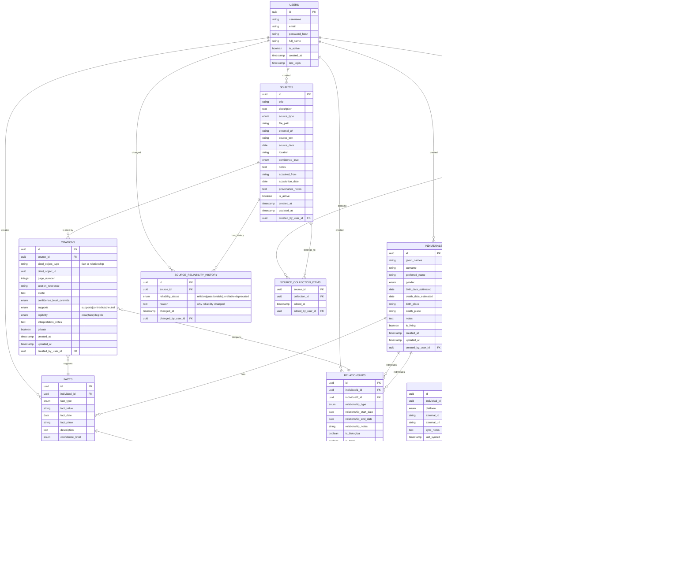

# Genealogical Source Management - Entity Relationship Model

## Core Design Principles
1. **Source-Centric**: All facts must be traceable to sources
2. **Auditability**: Complete history of data changes and source reliability
3. **Flexible Relationships**: Support for non-traditional family structures
4. **External Integration**: Links to records in other genealogy platforms

## Entity Relationship Diagram

## Key Design Features

### 1. Source-Centric Architecture
- Every fact and relationship must be linked to at least one source
- Sources can support, contradict, or be neutral toward facts
- Multiple sources can support the same fact with different evidence types

### 2. Comprehensive Auditability
- Complete change history for individuals and facts
- Source reliability tracking with historical changes
- User attribution for all changes and additions

### 3. Flexible Relationship Model
- Supports biological, legal, adoptive, step, and guardian relationships
- Handles non-traditional family structures
- Relationship start/end dates for complex family dynamics

### 4. External System Integration
- Links to records in Ancestry, MyHeritage, FamilySearch, etc.
- Sync tracking and status management
- Maintains independence while enabling cross-referencing

### 5. Research Workflow Support
- Research notes and task management
- Conflict detection and resolution tracking
- Source collections for organization

### 6. Data Quality Management
- Confidence levels for sources, facts, and relationships
- Primary vs alternative facts
- Soft deletion with is_active flags
- Conflicting facts identification and resolution

## Usage Patterns

### Adding a Source with Facts
1. Upload/create source record
2. Link individuals mentioned in source
3. Extract facts from source
4. Create citations links with evidence assessment
5. Note any conflicts with existing facts

### Deprecating Unreliable Sources
1. Update source reliability status
2. System flags all facts supported only by deprecated sources
3. User can review and find alternative sources or mark facts as questionable
4. Complete audit trail maintained

### Research Workflow
1. Identify research goals via research_notes
2. Find and evaluate sources
3. Extract and link facts
4. Resolve conflicts between sources
5. Track confidence levels and evidence quality
